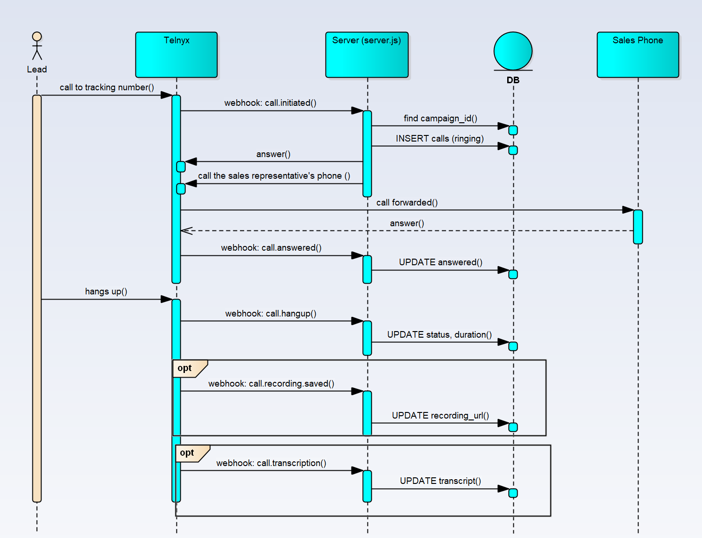

# Call tracking MVP (Telnyx)

Minimaalne töötav prototüüp: cold email'i signatuuris tracking-number →
sissetulev kõne → forward müügiinimese päris telefonile → kõne logimine
(kes, millal, kampaania, staatus, kestus) → valikuliselt salvestus ja transkript.

## Oluline märkus testimise kohta

Kogu allolev testimine tehti minu isikliku Telnyx testkonto ja testnumbriga
(+1 561 407 6745, USA testnumber, ostetud tasuta pretrial-krediitidega). See oli vajalik, et kontrollida,
kas kogu tehniline loogika (webhook, forward, logimine, salvestus) reaalselt
töötab, enne kui hakata seda päris süsteemiga siduma.

Kood ise on numbrist ja kontost sõltumatu — sama kood töötab suvalise
Telnyx kontoga, lihtsalt `.env` failis tuleb vahetada API key,
Application/Connection ID ja numbrid.

## Staatus: testitud ja töötab ✅

Terve kõne tsükkel testiti reaalselt 8. septembril 2026:
- Sissetulev kõne tracking-numbrile võeti vastu ja logiti andmebaasi
- Kõne forwarditi päris telefonile
- Kõnele vastamine registreeriti (`status: answered`)
- Kõne lõpp registreeriti koos täpse kestusega (`status: completed`, `duration_seconds`)
- Kõne salvestus lülitati sisse ja kinnitati töötavana — mp3 link
  salvestatakse andmebaasi ja seda sai reaalselt maha kuulata

Näide reaalsest kirjest andmebaasis pärast testi:
```json
{
  "from_number": "+37258379378",
  "tracking_number": "+15614076745",
  "status": "completed",
  "duration_seconds": 6,
  "answered_at": "2026-09-08 14:37:48",
  "ended_at": "2026-09-08 14:37:53",
  "recording_url": "https://s3.amazonaws.com/.../recording.mp3?..."
}
```

Transkript (`call.transcription`) — koodis on valmis handler
(`handleTranscription`), aga seda ei lülitatud eraldi sisse ega testitud —
see on ülesandes valikuline osa ("kui jõuad").

## Number-tracking loogika

Üks tracking-number kampaania/saatja kohta (mitte iga leadi kohta — see on
MVP jaoks liiga kallis ja liigne). Kõne sidumine konkreetse leadiga käib
Caller ID (`from`) järgi — vajadusel võrreldakse oma leadide andmebaasiga.

**Kuidas siduda number kampaaniaga** (tehakse üks kord uue kampaania
käivitamisel, enne kui number läheb signatuuri malli):
```bash
curl -X POST http://localhost:8000/numbers \
  -H "Content-Type: application/json" \
  -d '{"phone_number": "+15614076745", "campaign_id": "outreach-sept-2026", "sender_id": "myralum-outbound"}'
```
Pärast seda märgitakse kõik kõned sellele numbrile automaatselt vastava
`campaign_id`-ga logis.

## Oluline piirang, millega testimisel kokku puutusime

Telnyx **trial-konto** blokeerib vaikimisi väljuvad kõned väljapoole USA-d
(viga `D13: Dialed number is not included in whitelisted countries`) —
see on pettuste vastane kaitse tasuta kontodel, mitte koodi viga.

**Kuidas lahendada testimiseks**: lisa kontole natuke raha (piisab ~5 eurost)
— pärast seda saab Outbound Voice Profile'is lubada terve "Europe" piirkonna
ilma täieliku verifitseerimiseta, ja kõned Eestisse hakkavad läbi minema.
Meil see töötas täpselt nii.

Enne päris tootmisse minekut on ikkagi vaja läbida täielik Level 2
Verification (dokumendid, kuni 48 tundi) — see on kohustuslik, kui
müügiinimesed/leadid on erinevatest riikidest.

## Mida on vaja enne käivitamist

1. Telnyx konto + API key (Mission Control Portal → API Keys).
2. Ostetud number (testiks käsitsi portaali kaudu, produktsioonis
   Numbers API kaudu).
3. Voice API Application (Call Control Application) portaalis:
   - Voice → Programmable Voice → Voice API Applications → Create Voice App
   - Webhook URL: ngrok'i antud aadress + `/webhooks/telnyx`
   - Kopeeri Application ID (see on ka Connection ID)
   - Outbound Voice Profile peab olema seotud ja lubama vajalikke riike
     (vt eelmine peatükk kontole raha lisamise kohta)
4. Node.js 18+.
5. ngrok (lokaalseks arenduseks, et Telnyx pääseks su arvutini):
   `https://ngrok.com/download`

## Paigaldamine

```bash
npm init -y
npm install express telnyx dotenv better-sqlite3
```

Loo `.env` fail (näidis on failis `.env.example`):
TELNYX_API_KEY=sinu_võti
TELNYX_CONNECTION_ID=sinu_application_id
SALES_PHONE_NUMBER=+372_päris_müügiinimese_number
PORT=8000
RECORD_CALLS=true


## Lokaalne käivitamine

Terminal 1 — tunneli üleval hoidmine:
```bash
ngrok http 8000
```
Kopeeri saadud `https://...ngrok-free.dev` URL ja määra see + `/webhooks/telnyx`
Webhook URL-iks Telnyx portaalis Voice API Application'i seadetes.

Terminal 2 — serveri käivitamine:
```bash
npm start
```

## Kontrollimine
GET http://localhost:8000/calls
— näitab kõigi kõnede logi (from, tracking_number, campaign_id, staatus,
kestus, salvestuse link).

## Mida on vaja päris outbound süsteemiga ühendamiseks

- Läbida Telnyx konto täielik Level 2 Verification (vt piirang eespool)
  — kohustuslik, kui müügiinimesed/leadid on erinevatest riikidest
- Automatiseerida numbri ostmine uue kampaania käivitamisel (Numbers API
  kaudu) käsitsi `curl`-päringu asemel
- Serveri deploy püsivale avalikule URL-ile ngrok'i asemel (Railway,
  Render, VPS jms) — webhook peab olema kättesaadav 24/7
- Ostetud numbri automaatne lisamine email-signatuuri malli
- `calls.campaign_id` / `calls.from_number` sidumine päris leadide
  andmebaasiga, et näha mitte lihtsalt numbrit, vaid leadi nime ja kaarti
- Transkriptsiooni sisselülitamine (Telnyx STT) ja soovi korral transkripti
  läbi AI jooksutamine automaatse kokkuvõtte jaoks

## Ligikaudne kulu

Number — $1/kuu. Kõned — ~$0.007/min. Salvestus — $0.002/min.
Transkriptsioon — Telnyx STT hindade järgi, samuti minutite kaupa.
Tagasihoidliku mahu juures (10 numbrit, paarsada kõnet kuus, igaüks
3-5 minutit) — umbes $20-60/kuu, arendustööd arvestamata.


## Diagramm
